# [janedoe-photography](https://emanuelsemer.github.io/janedoe-photography)

Developer: Emanuel Semerson ([Emanuelsemer](https://www.github.com/Emanuelsemer))

# Welcome to Jane Doe Portrait Photography. #
This website is designed to introduce potential clients to Jane’s work as a New York-based portrait photographer with over ten years of professional experience. Specializing in authentic portraits, personal branding, and creative headshots, Jane’s goal is to create images that not only look beautiful — but feel honest, personal, and deeply human.

The primary aim of this site is to serve as a professional and welcoming space where visitors can explore her curated portfolio, learn more about her approach, and easily reach out to book a session. Whether you’re an entrepreneur, artist, actor, or simply someone who wants to be captured in a way that feels true to who you are, this site is built with you in mind.

Calm, collaborative, and connection-driven, Jane’s sessions are about more than photography — they’re about helping people feel seen. This website reflects that same spirit, offering a smooth and engaging experience for anyone looking to turn real moments into lasting images.

source: [janedoe-photography amiresponsive](https://ui.dev/amiresponsive?url=https://emanuelsemer.github.io/janedoe-photography)

## UX

### The 5 Planes of UX

#### 1. Strategy

**Purpose**
- Showcase high-quality portrait photography to attract potential clients.
- Make it easy for users to inquire, contact the photographer and view the photographer's work. 

**Primary User Needs**
- View portfolio and photography style.
- Easily contact the photographer.
- Getting to know the photographers background and story. 

**Business Goals**
- Attract new potrait photography clients.
- Increase inquiries and bookings. 
- Build a recognizable personal brand through visual storytelling. 

#### 2. Scope

**[Features](#features)** (see below)

**Content Requirements**
- High-quality images for the homepage and portfolio.
- Clear and authentic descriptions of photography style.
- Contact form for inquiries and bookings.

#### 3. Structure

**Information Architecture**
- **Navigation Menu**:
  - Home | Portfolio | Contact
- **Hierarchy**:
  - Hero image with artistic feeling. 
  - Clear call-to-action 
  - Prominent display of featured work. 
  - Prominent placement of social media links and contact details in the footer.

**User Flow**
1. User lands on the Home page → learns about Jane Doe and her photography style.
2. Navigates to the Portfolio page → browses through curated portrait photos. 
3. Visits the Contact page → views the contact form and inspiring photo.
4. Fills out and submits the contact form → sends inquiry.

5. Sees confirmation → waits for Jane Doe to respond. 

#### 4. Skeleton

**[Wireframes](#wireframes)** (see below)

#### 5. Surface

**Visual Design Elements**
- **[Colours](#colour-scheme)** (see below)
- **[Typography](#typography)** (see below)

### Colour Scheme

For this website, I chose a minimal and elegant monochrome color scheme, designed to highlight the photography work without visual distractions. The simplicity ensures that the viewer's focus stays on the photos.

Primary Background: #ffffff (white) — Used for the background across the entire site. It provides a clean and neutral canvas for both text and images.

Text Color: #000000 (black) — Classic and high-contrast for optimal readability against the white background.

Footer Background: #f5f5f5 — A very light grey used in the footer to gently separate it from the rest of the page while maintaining the minimalist feel.

This timeless black-on-white design is widely used in editorial and gallery-style websites, especially for photographers and artists, because it reflects professionalism, clarity, and elegance.

I used [coolors.co]() to generate my color palette.

- `#000000` (Black) Primary text.
- `#FFFFFF` (White) Background.
- `#f5f5f5` (Very light grey) Footer Background.

### Typography

#### Font

The website uses the default Bootstrap font stack (--bs-body-font-family), which typically includes:

- system-ui, -apple-system, Segoe UI, Roboto, Helvetica Neue, Arial, sans-serif

This system font stack ensures fast loading, great cross-device compatibility, and a clean, modern appearance without needing external font imports.

#### Icons

The site uses Font Awesome for social media icons and other visual elements.

Font Awesome provides scalable vector icons that are easy to customize with CSS.

Linked via CDN:
https://kit.fontawesome.com/3b20d96fa9.js

Official site: https://fontawesome.com/

## Mock-ups

To ensure a clean and intentional user experience, I created high-fidelity mockups for all three pages of my portrait photography website using a visual design tool inspired by Figma.

Each page was designed with layout, spacing, and responsiveness in mind. These mockups guided my HTML and CSS development and reflect the final structure of the site.

| Page | Mobile | Tablet | Desktop |
| --- | --- | --- | --- |
| Home | |  |](<documentation/mockups /desktop/homepage/homepage.png>) |
| Portfolio | ![!\[Mobile Portfolio\]](<documentation/mockups /mobile/portfoliopage/portfolio-iphone-se.png>) | |  |
| Contact |  |  | |
| Confirmation |  | | |
| 404 |  |  |  |

## User Stories

| **Target**                  | **Expectation**                                                 | **Outcome**                                                           |
| --------------------------- | --------------------------------------------------------------- | --------------------------------------------------------------------- |
| As a user                | I want to see a clear main navigation menu                      | so that I can easily move between the main sections of the site.      |
| As a user                   | I want the content to be structured with clear headings         | so that I can find what I’m looking for without confusion.            |
| As a user            | I want the website to adjust to my screen size                  | so that I can use it comfortably on any device.                       |
| As a user | I want high contrast and alt text for images                    | so that I can understand the content using assistive technology.      |
| As a visitor                | I want all graphics to have a consistent style and color scheme | so the site looks professional and unified.                           |
| As a visitor                | I want foreground content to remain clear and readable          | so I can focus on the text without distraction from backgrounds.      |
| As a potential client       | I want to view a gallery of portrait images                     | so I can evaluate the photographer’s style and quality.               |
| As a visitor                | I want to read about the photographer                           | so I can understand their background and creative approach.           |
| As a potential client       | I want to contact the photographer via a form           | so I can easily request a portrait session.                           |

## Features

### Existing Features

| **Feature**                            | **Notes**                                                                                                                                                                                                                                                   | **Screenshot**                                             |
| -------------------------------------- | --------------------------------------------------------------------------------------------------------------------------------------------------------------------------------------------------------------------------------------------------------------------------------- | ---------------------------------------------------------- |
| **Navbar**                             | Appears on all three pages (Home, Portfolio, Contact). Provides links to key sections with a clean, minimal design. On mobile, it collapses into a hamburger menu, improving usability across devices. Ensures users can navigate easily without using the browser’s back button. |           |
| **Hero Image (Home)**                  | The homepage starts with a large hero image of a ballet dancer, visually establishing the artistic and professional tone. This grabs the user’s attention immediately and sets the mood for the photographer’s style.                                                             | /Screenshot 2025-05-16 at 22.07.22.png>)|
| **About Section**                      | Located on the homepage, this section introduces Jane Doe and her photography philosophy. Helps build trust and personal connection with the user, especially potential clients.                                                                                                  |  |
| **Call to Action (Contact Me Button)** | A clear button at the end of the About section encourages visitors to initiate contact. It is visually distinct and linked directly to the Contact page.                                                                                                                          |  |
| **Portfolio Grid**                     | The Portfolio page displays a 4-column responsive grid of curated portrait photos. This allows users to visually explore the photographer’s range and style with ease. Grid layout adjusts for mobile and tablet views.                                                           | |
| **Contact Form**                       | A simple and accessible form allows visitors to send their first name, last name, email, and message. With a submit button on the bottom.                                                               |   |
| **Footer**                             | Present on all pages. Includes contact email, phone number, and icons linked to Instagram, Facebook, and LinkedIn. All links open in new tabs. Reinforces brand presence and allows continued engagement off-site.                                                                | |
| **Responsive Design**                  | All pages adapt seamlessly across mobile, tablet, and desktop devices using Bootstrap’s grid system and media queries. Ensures a smooth experience regardless of screen size.                                                                                                     |   |
| **404 Page**                           | A custom 404 page is included to help guide users who navigate to a non-existent route. It maintains the site’s visual style and includes the same navigation and footer for consistency.                                                                                         |            |
| **Confirmation Redirect**              | After submitting the contact form, the user is redirected to a confirmation page or thank-you state. While no database is used, this gives the user feedback and closure.                                                                                                         | |

### Future Features

- **Calendly Integration**: Allow users to book sessions directly through the website by embedding a Calendly widget. This eliminates scheduling delays and streamlines communication, providing clients with instant access to available time slots for different types of sessions (e.g., headshots, family portraits, branding shoots).
- **Client Testimonials Carousel**: Feature a rotating carousel of real client testimonials on the homepage or portfolio page to build trust and credibility. Testimonials would include photos from their sessions and a quote about their experience.
- **Client Preparation Guide Download**: Offer a downloadable PDF or web-based guide that helps clients prepare for their session — with tips on clothing, makeup, timing, and mindset. This helps reduce no-shows and increases shoot quality.
- **AI Booking Assistant**: Add a AI assistant to answer quick questions about pricing, availability, or session types. This improves client communication and increases conversions from site visitors.
- **Session Countdown & Reminders**: After booking, show users a live countdown to their session with the option to receive email or SMS reminders. This helps build anticipation and reduce missed appointments.
- **Before & After Slider Tool**: Integrate a photo comparison slider that shows before and after retouching or editing. This helps potential clients understand the value of professional editing and builds confidence in the final product.
- **Session Preparation tool**: Introduce an interactive feature within the booking form that allows clients to view and select from a gallery of sample portrait poses or session styles. This tool will help clients better prepare for their photoshoot by setting expectations and communicating their preferences in advance, resulting in a more seamless and personalized photography experience.

## Tools & Technologies

| Tool / Tech | Use |
| --- | --- |
|  | Generate README and TESTING templates. |
|  | Version control. (`git add`, `git commit`, `git push`) |
|  | Secure online code storage. |
|  | Local IDE for development. |
|  | Main site content and layout. |
|  | Design and layout. |
|  | Hosting the deployed front-end site. |
|  | Front-end CSS framework for modern responsiveness and pre-built components. |
|  | Creating mockups. |
|  | Icons. |
|  | Help debug, troubleshoot,generate text content and explain things. |
|  | Tutorials/Reference Guide |

## Agile Development Process

### GitHub Projects

[GitHub Projects](https://www.github.com/Emanuelsemer/janedoe-photography/projects) served as an Agile tool for this project. Through it, User Stories, issues/bugs, and Milestone tasks were planned, then subsequently tracked on a regular basis using the Kanban project board.

### GitHub Issues

[GitHub Issues](https://www.github.com/Emanuelsemer/janedoe-photography/issues) served as an another Agile tool. There, I managed my User Stories and Milestone tasks, and tracked any issues/bugs.

| Link | Screenshot |
| --- | --- |
|  | |
|  |  |

### MoSCoW Prioritization

I've decomposed my Epics into User Stories for prioritizing and implementing them. Using this approach, I was able to apply "MoSCoW" prioritization and labels to my User Stories within the Issues tab. I created the User Stories from the requirements for the milestone project. 

- **Must Have**: guaranteed to be delivered - required to Pass the project 

# Testing

## Code Validation

### HTML

I have used the recommended [HTML W3C Validator](https://validator.w3.org) to validate all of my HTML files.

| Directory | File | URL | Screenshot | Notes |
| --- | --- | --- | --- | --- |
|  | [404.html](https://github.com/Emanuelsemer/janedoe-photography/blob/main/404.html) | [HTML Validator](https://validator.w3.org/nu/?doc=https://emanuelsemer.github.io/janedoe-photography/404.html) |  | Error were on the external code |
|  | [contact.html](https://github.com/Emanuelsemer/janedoe-photography/blob/main/contact.html) | [HTML Validator](https://validator.w3.org/nu/?doc=https://emanuelsemer.github.io/janedoe-photography/contact.html) | | Error were on the external code|
|  | [index.html](https://github.com/Emanuelsemer/janedoe-photography/blob/main/index.html) | [HTML Validator](https://validator.w3.org/nu/?doc=https://emanuelsemer.github.io/janedoe-photography/index.html) |  | Error were on the external code
|  | [portfolio.html](https://github.com/Emanuelsemer/janedoe-photography/blob/main/portfolio.html) | [HTML Validator](https://validator.w3.org/nu/?doc=https://emanuelsemer.github.io/janedoe-photography/portfolio.html) |  | Error on external code|
|  | [success.html](https://github.com/Emanuelsemer/janedoe-photography/blob/main/success.html) | [HTML Validator](https://valisdator.w3.org/nu/?doc=https://emanuelsemer.github.io/janedoe-photography/success.html) | | Error on the external code

### CSS

I have used the recommended [CSS Jigsaw Validator](https://jigsaw.w3.org/css-validator) to validate all of my CSS files.

| Directory | File | URL | Screenshot | Notes |
| --- | --- | --- | --- | --- |
| assets | [style.css](https://github.com/Emanuelsemer/janedoe-photography/blob/main/assets/css/style.css) | [CSS Validator](https://jigsaw.w3.org/css-validator/validator?uri=https://emanuelsemer.github.io/janedoe-photography) |  |  |

## Responsiveness

I've tested my deployed project to check for responsiveness issues.

| Page | Mobile | Tablet | Desktop | Notes |
| --- | --- | --- | --- | --- |
| Home | 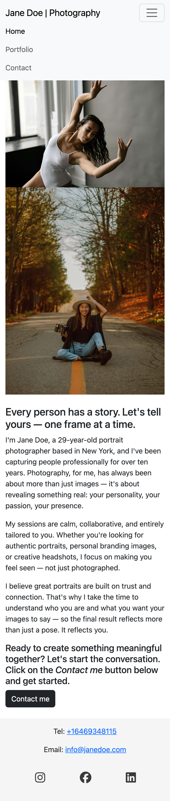|  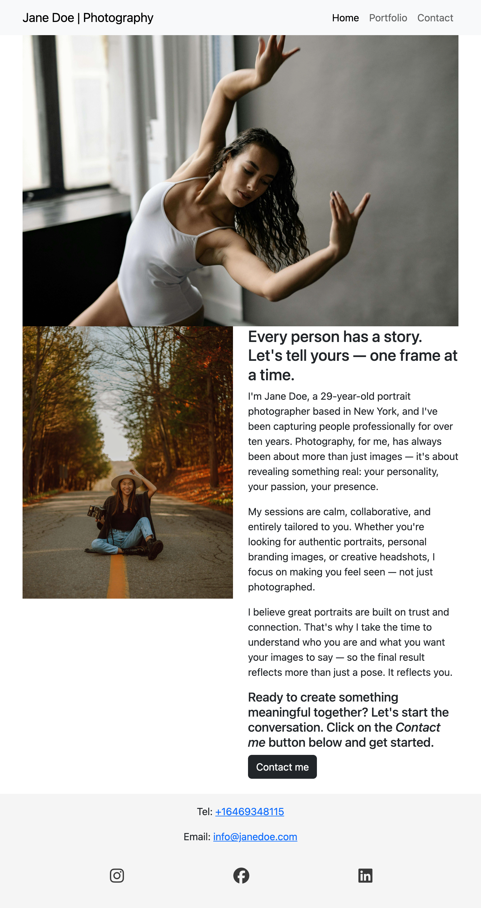| 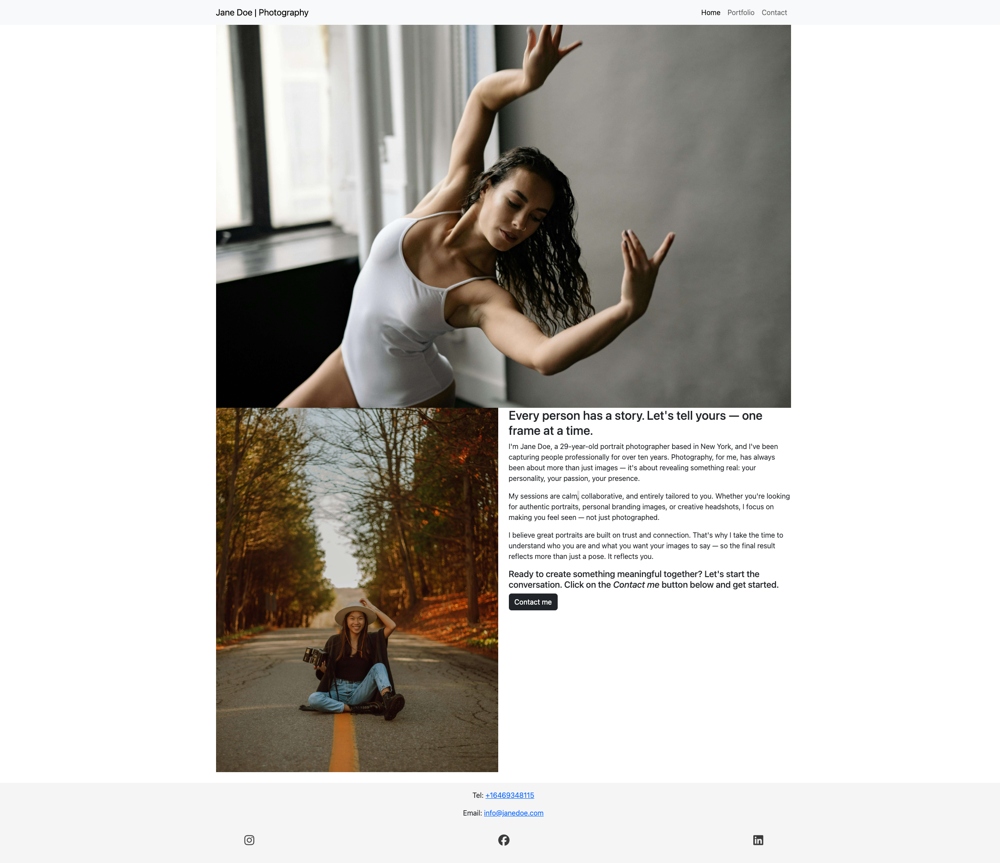 | Works as expected |
| Portfolio |  | |  | Works as expected |
| Contact | 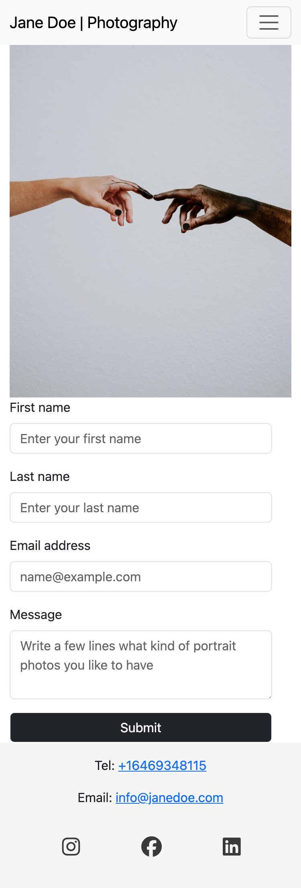| 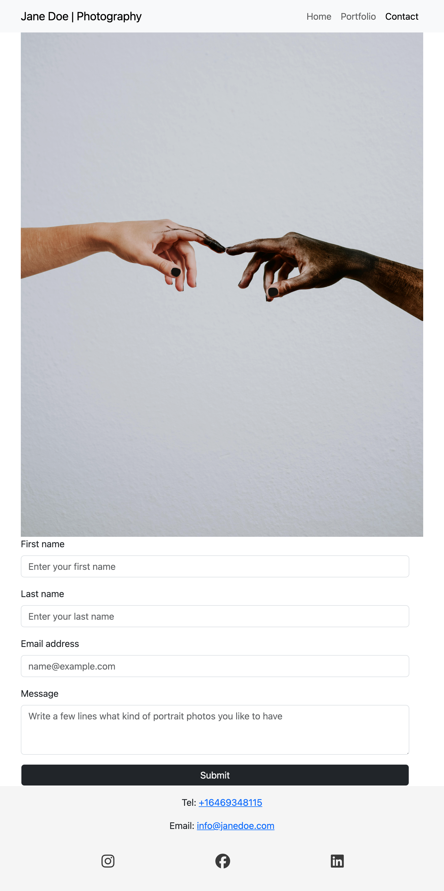| 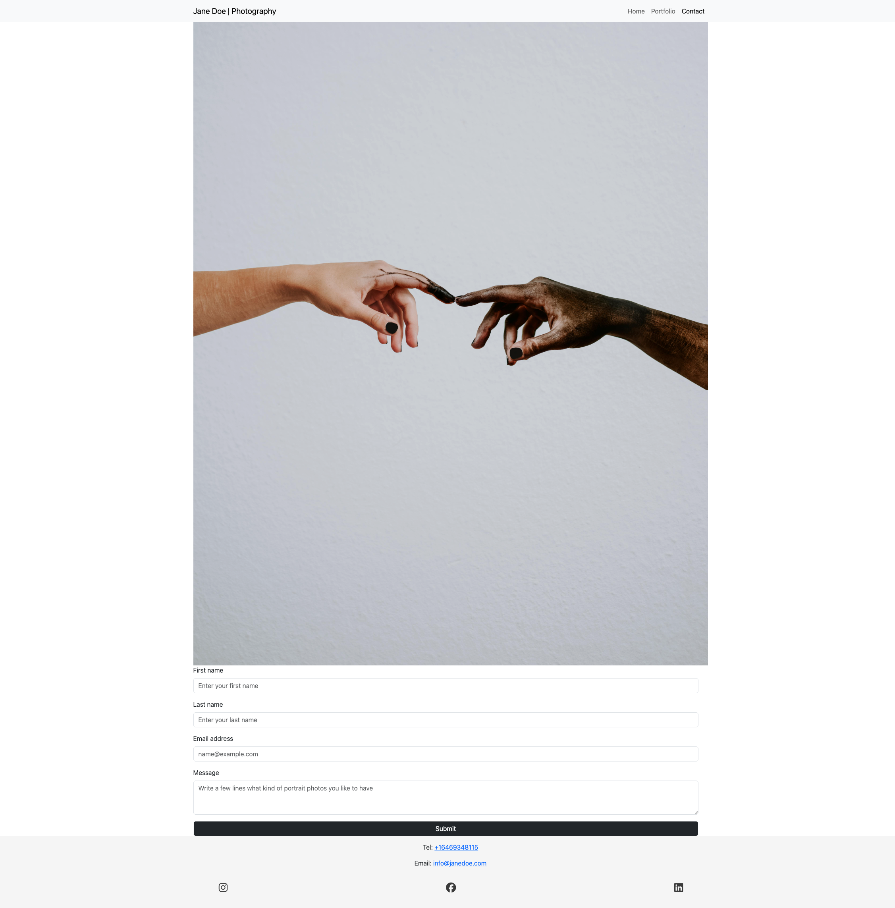| Works as expected |
| Confirmation | 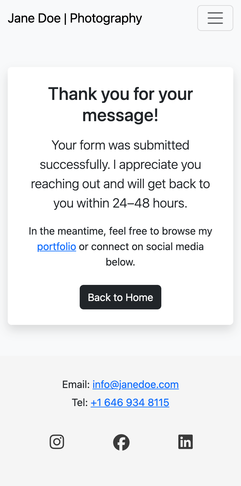 | 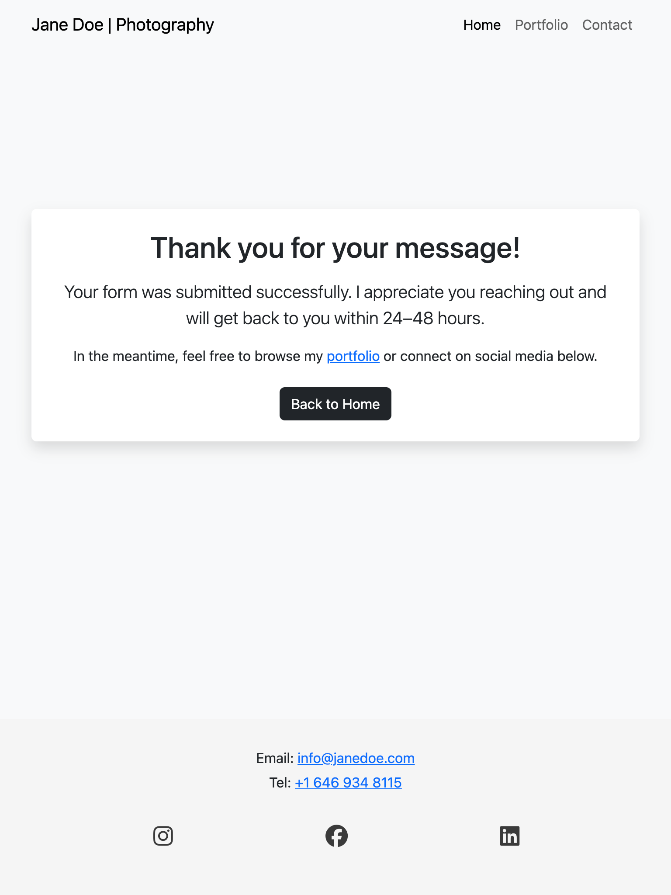| 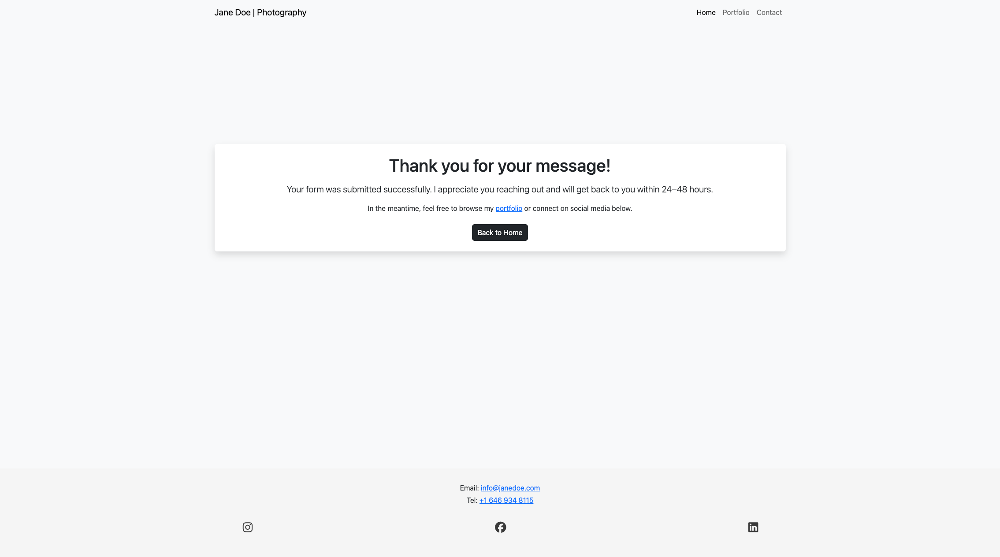 | Works as expected |
| 404 | 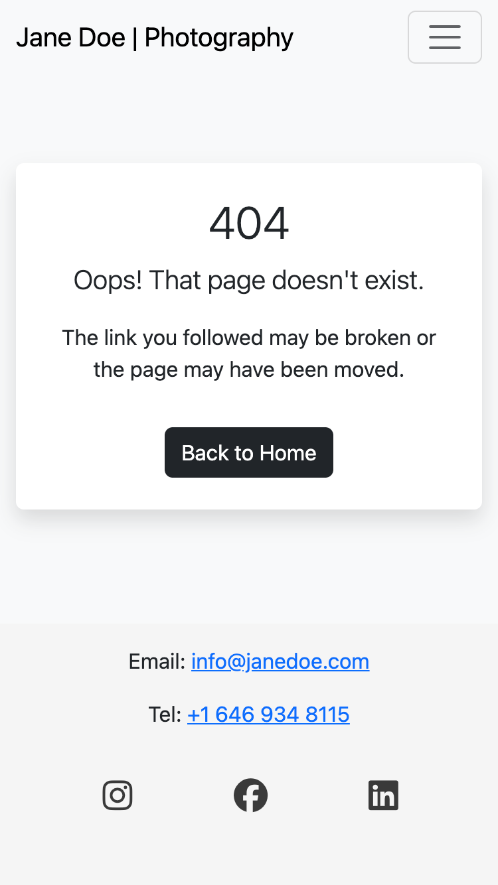 | 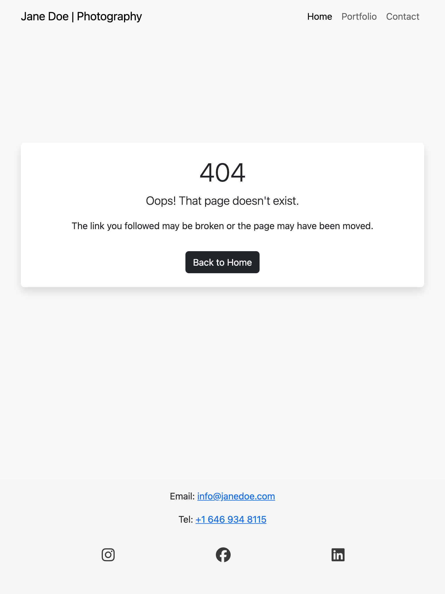| 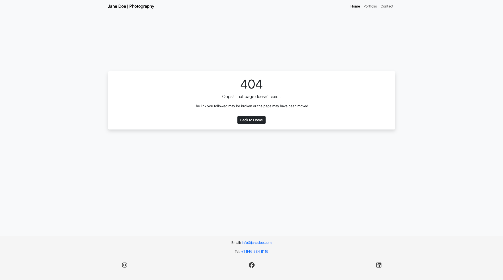 | Works as expected |

## Browser Compatibility

I've tested my deployed project on multiple browsers to check for compatibility issues.

| Page | Chrome | Firefox | Safari | Notes |
| --- | --- | --- | --- | --- |
| Home |  |  | | Works as expected |
| Portfolio |  |  |  | Works as expected |
| Contact |  | | | Works as expected |
| Confirmation | |  | | Works as expected |
| 404 | |  |  | Works as expected |

## Lighthouse Audit

⚠️ INSTRUCTIONS ⚠️

Use this space to discuss testing the live/deployed site's Lighthouse Audit reports. Avoid testing the local version (Gitpod/VSCode/etc.), as this can have knock-on effects for performance. If you don't have "Lighthouse" in your Developer Tools, it can be added as an [extension](https://chrome.google.com/webstore/detail/lighthouse/blipmdconlkpinefehnmjammfjpmpbjk).

Unless your project is a single-page application (SPA), you should test Lighthouse Audit results for all of your pages, for both *mobile* and *desktop*.

**IMPORTANT**: You must provide screenshots of the results, to "prove" that you've actually tested them.

⚠️ --- END --- ⚠️

I've tested my deployed project using the Lighthouse Audit tool to check for any major issues. Some warnings are outside of my control, and mobile results tend to be lower than desktop.

| Page | Mobile | Desktop |
| --- | --- | --- |
| Home | | |
| Portfolio |  |  |
| Contact |  |  |
| Confirmation |  |  |
| 404 |  |  |

## Defensive Programming

⚠️ INSTRUCTIONS ⚠️

Defensive programming (defensive design) is extremely important! When building projects that accept user inputs or forms, you should always test the level of security for each form field. Examples of this could include (but not limited to):

All Projects:

- Users cannot submit an empty form (add the `required` attribute)
- Users must enter valid field types (ensure the correct input `type=""` is used)
- Users cannot brute-force a URL to navigate to a restricted pages

Python Projects:

- Users cannot perform CRUD functionality if not authenticated (if login functionality exists)
- User-A should not be able to manipulate data belonging to User-B, or vice versa
- Non-Authenticated users should not be able to access pages that require authentication
- Standard users should not be able to access pages intended for superusers/admins

You'll want to test all functionality on your application, whether it's a standard form, or CRUD functionality, for data manipulation on a database. Try to access various pages on your site as different user types (User-A, User-B, guest user, admin, superuser). You should include any manual tests performed, and the expected results/outcome.

Testing should be replicable (can someone else replicate the same outcome?). Ideally, tests cases should focus on each individual section of every page on the website. Each test case should be specific, objective, and step-wise replicable.

Instead of adding a general overview saying that everything works fine, consider documenting tests on each element of the page (eg. button clicks, input box validation, navigation links, etc.) by testing them in their "happy flow", their "bad/exception flow", mentioning the expected and observed results, and drawing a parallel between them where applicable.

Consider using the following format for manual test cases:

- Expected Outcome / Test Performed / Result Received / Fixes Implemented

- **Expected**: "Feature is expected to do X when the user does Y."
- **Testing**: "Tested the feature by doing Y."
- (either) **Result**: "The feature behaved as expected, and it did Y."
- (or) **Result**: "The feature did not respond to A, B, or C."
- **Fix**: "I did Z to the code because something was missing."

Use the table below as a basic start, and expand on it using the logic above.

⚠️ --- END --- ⚠️

Defensive programming was manually tested with the below user acceptance testing:

| Page | Expectation | Test | Result | Screenshot |
| --- | --- |  --- |  --- |  --- |
| Home | Feature is expected to display examples of why users should join. | Verified that the page displays the club’s mission and purpose in a clear and concise manner. | The mission and purpose were displayed as expected. |  |
| | Feature is expected to have accessible navigation links. | Checked navigation links for correct functionality and accessibility. | Navigation links were functional and accessible. |  |
| | Feature is expected to be fully responsive. | Resized the browser window and tested on multiple devices (mobile, tablet, desktop). | The page was responsive across all tested screen sizes. |  |
| Schedule/Timetable | Feature is expected to show the running schedule/timetable for sessions. | Confirmed that the page contains a structured table or list with session timings. | Timetable was displayed as expected. |  |
| Events | Feature is expected to display details of different running events. | Verified that the page lists upcoming events with relevant details. | Event details were displayed as expected. |  |
| Gallery | Feature is expected to showcase a gallery of past events. | Verified that the gallery contains clear images that aren't stretched, pixelated, and fully responsive. | Images are properly sized, and respond well to different device sizes. |  |
| Sign-Up Form | Feature is expected to prevent submission of an empty form. | Attempted to submit the form without filling any fields. | Form submission was blocked, as expected. |  |
| | Feature is expected to enforce valid input types for each field. | Entered invalid data (e.g., random text in an email field, numbers in a name field, etc.). | Error messages were displayed appropriately, and submission was blocked. |  |
| Social Links | Feature is expected to include working links to the club’s social platforms (Instagram, Facebook, etc.). | Clicked each social link to verify redirection to the correct platform page. | All links redirected to the correct platform pages, opening in new browser tabs. |  |
| 404 Error Page | Feature is expected to display a 404 error page for non-existent pages. | Navigated to an invalid URL (e.g., `/test`) to test error handling. | A custom 404 error page was displayed as expected. |  |

## User Story Testing

⚠️ INSTRUCTIONS ⚠️

Testing User Stories is actually quite simple, once you've already got the stories defined on your README.

Most of your project's **Features** should already align with the **User Stories**, so this should be as simple as creating a table with the User Story, matching with the re-used screenshot from the respective Feature.

⚠️ --- END --- ⚠️

| Target | Expectation | Outcome | Screenshot | 
| --- | --- | --- | --- | 
| As a user | I would like to see examples of why I should join | so that I can learn about the club’s mission and purpose before deciding to join. |  |
| As a user | I would like to view the running schedule/timetable | so that I can decide when to join a session. |  |
| As a user | I would like to see the details of different running events | so that I can prepare accordingly. |  |
| As a user | I would like to view a gallery of past events | so that I can see photos of myself and others from previous runs. |  |
| As a user | I would like to sign up for the running club | so that I can join the community and participate in events. |  |
| As a user | I would like to follow the club on various platforms (e.g., Instagram, Facebook, Twitter) | so that I can stay updated with club news and events. |  |
| As a user | I would like the website to be fully responsive | so that I can easily navigate and access information from my phone, tablet, or desktop. |  |
| As a user | I would like to see a 404 error page if I get lost | so that it's obvious that I've stumbled upon a page that doesn't exist. |  |

## Bugs

⚠️ INSTRUCTIONS ⚠️

Nobody likes bugs,... except the assessors! Projects seem more suspicious if a student doesn't properly track their bugs. If you're about to submit your project without any bugs listed below, you should ask yourself why you're doing this course in the first place, if you're able to build this entire application without running into any bugs. The best thing you can do for any project is to document your bugs! Not only does it show the true stages of development, but think of it as breadcrumbs for yourself in the future, should you encounter the same/similar bug again, it acts as a gentle reminder on what you did to fix the bug.

If/when you encounter bugs during the development stages of your project, you should document them here, ideally with a screenshot explaining what the issue was, and what you did to fix the bug.

Alternatively, an improved way to manage bugs is to use the built-in **[Issues](https://www.github.com/Emanuelsemer/janedoe-photography/issues)** tracker on your GitHub repository. This can be found at the top of your repository, the tab called "Issues".

If using the Issues tracker for bug management, you can simplify the documentation process for testing. Issues allow you to directly paste screenshots into the issue page without having to first save the screenshot locally. You can add labels to your issues (e.g. `bug`), assign yourself as the owner, and add comments/updates as you progress with fixing the issue(s). Once you've solved the issue/bug, you should then "Close" it.

When showcasing your bug tracking for assessment, you can use the following examples below.

⚠️ --- END --- ⚠️

### Fixed Bugs

I've used [GitHub Issues](https://www.github.com/Emanuelsemer/janedoe-photography/issues) to track and manage bugs and issues during the development stages of my project.

All previously closed/fixed bugs can be tracked [here](https://www.github.com/Emanuelsemer/janedoe-photography/issues?q=is%3Aissue+is%3Aclosed+label%3Abug).

### Unfixed Bugs

⚠️ INSTRUCTIONS ⚠️

You will need to mention any unfixed bugs and why they are not fixed upon submission of your project. This section should include shortcomings of the frameworks or technologies used. Although time can be a big variable to consider, paucity of time and difficulty understanding implementation is not a valid reason to leave bugs unfixed. Where possible, you must fix all outstanding bugs, unless outside of your control.

If you've identified any unfixed bugs, no matter how small, be sure to list them here! It's better to be honest and list them, because if it's not documented and an assessor finds the issue, they need to know whether or not you're aware of them as well, and why you've not corrected/fixed them.

⚠️ --- END --- ⚠️

Any remaining open issues can be tracked [here](https://www.github.com/Emanuelsemer/janedoe-photography/issues).

### Known Issues

| Issue | Screenshot |
| --- | --- |
| On devices smaller than 375px, the page starts to have horizontal `overflow-x` scrolling. |  |
| When validating HTML with a semantic `<section>` element, the validator warns about lacking a header `h2-h6`. This is acceptable. |  |

> [!IMPORTANT]
> There are no remaining bugs that I am aware of, though, even after thorough testing, I cannot rule out the possibility.

## Deployment

### GitHub Pages

The site was deployed to GitHub Pages. The steps to deploy are as follows:

- In the [GitHub repository](https://www.github.com/Emanuelsemer/janedoe-photography), navigate to the "Settings" tab.
- In Settings, click on the "Pages" link from the menu on the left.
- From the "Build and deployment" section, click the drop-down called "Branch", and select the **main** branch, then click "Save".
- The page will be automatically refreshed with a detailed message display to indicate the successful deployment.
- Allow up to 5 minutes for the site to fully deploy.

The live link can be found on [GitHub Pages](https://emanuelsemer.github.io/janedoe-photography).

### Local Development

This project can be cloned or forked in order to make a local copy on your own system.

#### Cloning

You can clone the repository by following these steps:

1. Go to the [GitHub repository](https://www.github.com/Emanuelsemer/janedoe-photography).
2. Locate and click on the green "Code" button at the very top, above the commits and files.
3. Select whether you prefer to clone using "HTTPS", "SSH", or "GitHub CLI", and click the "copy" button to copy the URL to your clipboard.
4. Open "Git Bash" or "Terminal".
5. Change the current working directory to the location where you want the cloned directory.
6. In your IDE Terminal, type the following command to clone the repository:
	- `git clone https://www.github.com/Emanuelsemer/janedoe-photography.git`
7. Press "Enter" to create your local clone.

Alternatively, if using Gitpod, you can click below to create your own workspace using this repository.

**Please Note**: in order to directly open the project in Gitpod, you should have the browser extension installed. A tutorial on how to do that can be found [here](https://www.gitpod.io/docs/configure/user-settings/browser-extension).

#### Forking

By forking the GitHub Repository, you make a copy of the original repository on our GitHub account to view and/or make changes without affecting the original owner's repository. You can fork this repository by using the following steps:

1. Log in to GitHub and locate the [GitHub Repository](https://www.github.com/Emanuelsemer/janedoe-photography).
2. At the top of the Repository, just below the "Settings" button on the menu, locate and click the "Fork" Button.
3. Once clicked, you should now have a copy of the original repository in your own GitHub account!

### Local VS Deployment

There are no remaining major differences between the local version when compared to the deployed version online.

## Credits

Credit: Chatgpt code for being able to submit a form and land on the sucess page. (there is javascript wish i haven't learned yet)

            

Credit: Love running project code for social media links 

### Content

| Source | Notes |
| --- | --- |
| [Markdown Builder](https://markdown.2bn.dev) | Help generating Markdown files |
| [Light_trails website](https://github.com/RazmikMovsisyan/light_trails) | Photography website inspired by contact details in footer section |
| [Love running project](https://github.com/Code-Institute-Solutions/love-running-v3/blob/main/7.2-styling-the-form/index.html) | Code Institute walkthrough project inspiration for footer social media links. |
| [Bootstrap](https://getbootstrap.com) | Various components / responsive front-end framework |
| [ChatGPT](https://chatgpt.com) | Help with code logic, explanations and generate text content. |

## Media

All photos used in this project were sourced from Pexels, a free and royalty-free media platform. Attribution is not required under their license, but full credit is listed below to respect the creators.

### Home Page & Contact Page 

| **Usage**                            | **Photographer**  | **Link**                                                                             |
| ------------------------------------ | ----------------- | ------------------------------------------------------------------------------------ |
| Portrait of Jane Doe (About section) | Majestical Jasmin | [View on Pexels](https://www.pexels.com/photo/vag-natur-kvinna-kamera-5870338/)      |
| Hero Image (Home)                    | Yan Krukau        | [View on Pexels](https://www.pexels.com/photo/kvinna-dans-rorlig-bokeh-6616717/)     |
| Contact Page Background              | Lil Artsy         | [View on Pexels](https://www.pexels.com/photo/hands-covered-in-black-paint-5541019/) |

### Portfolio Images

| **Description**                              | **Photographer**  | **Link**                                                                                            |
| -------------------------------------------- | ----------------- | --------------------------------------------------------------------------------------------------- |
| Tattooed woman seated in red pants           | Mozzapics         | [View](https://www.pexels.com/sv-se/foto/portratt-av-en-tatuerad-kvinna-i-rodbruna-byxor-31948311/) |
| Elderly man with a straw hat                 | Gustavo Fring     | [View](https://www.pexels.com/photo/1933873/)                                                       |
| Black and white vintage woman with cigarette | Guilherme Almeida | [View](https://www.pexels.com/photo/1858175/)                                                       |
| Woman with dramatic lighting in black dress  | Shahin Khalaji    | [View](https://www.pexels.com/photo/14497001/)                                                      |
| Studio-lit woman dancing                     | Shutter Craftsman | [View](https://www.pexels.com/photo/31856525/)                                                      |
| Woman in hat with red curly hair             | Pete79            | [View](https://www.pexels.com/photo/19908239/)                                                      |
| Man with sunglasses and saxophone            | DJ Saxxo          | [View](https://www.pexels.com/photo/16543610/)                                                      |
| Woman in veil with striking green eyes       | Jonaorle          | [View](https://www.pexels.com/photo/4029925/)                                                       |
| Baby girl in pink with balloons              | Ifeyin Ka Studios | [View](https://www.pexels.com/photo/29899042/)                                                      |
| Laughing woman in modern chair               | Cottonbro Studio  | [View](https://www.pexels.com/photo/7319479/)                                                       |
| Glitter-covered woman posing creatively      | Kool Shooters     | [View](https://www.pexels.com/photo/7693358/)                                                       |
| Smiling man in sunlight                      | Chloe Kala Artist | [View](https://www.pexels.com/photo/1043474/)                                                       |

| Source | Notes |
| --- | --- |
| [favicon.io](https://favicon.io) | Generating the favicon |
| [Font Awesome](https://fontawesome.com) | Icons used throughout the site |
| [Pexels](https://images.pexels.com/photos/416160/pexels-photo-416160.jpeg) | Hero image |
| [TinyPNG](https://tinypng.com) | Compressing images < 5MB |

### Acknowledgements

- I would like to thank my Code Institute mentor, [Tim Nelson](https://www.github.com/TravelTimN) for the support throughout the development of this project.
- I would like to thank the [Code Institute](https://codeinstitute.net) Tutor Team for their assistance with troubleshooting and debugging some project issues.
- I would like to thank the [Code Institute Slack community](https://code-institute-room.slack.com) for the moral support; it kept me going during periods of self doubt and impostor syndrome.
- I would like to thank my friends and family, for believing in me, and allowing me to make this transition into software development.

